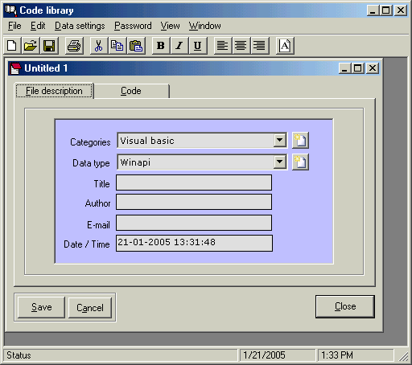



## Programmer library

### Description

This application is to make easy programmer working. The reason is; almost programmer always using same code for an application, such as database programmer, in database programming there are some categoroy update, delete and adding data, commontly code is always same event it defferent table.

Every code you insert can be save in .RTF format so you can easy to print it, and save to database directly. If you using same code again now you can copy the old code which has been saved in code library, then paste the code to your project, how easyly is it.<a href="http://www.einu.net">Another article</a>
 
### More Info
 

             |
---                |---
**Submitted On**   |2004-08-21 20:41:08
**By**             |[yudi astira](https://github.com/Planet-Source-Code/PSCIndex/blob/master/ByAuthor/yudi-astira.md)
**Level**          |Advanced
**User Rating**    |4.8 (24 globes from 5 users)
**Compatibility**  |VB 5\.0, VB 6\.0
**Category**       |[Complete Applications](https://github.com/Planet-Source-Code/PSCIndex/blob/master/ByCategory/complete-applications__1-27.md)
**World**          |[Visual Basic](https://github.com/Planet-Source-Code/PSCIndex/blob/master/ByWorld/visual-basic.md)
**Archive File**   |[Programmer1842341212005\.zip](https://github.com/Planet-Source-Code/yudi-astira-programmer-library__1-58406/archive/master.zip)

